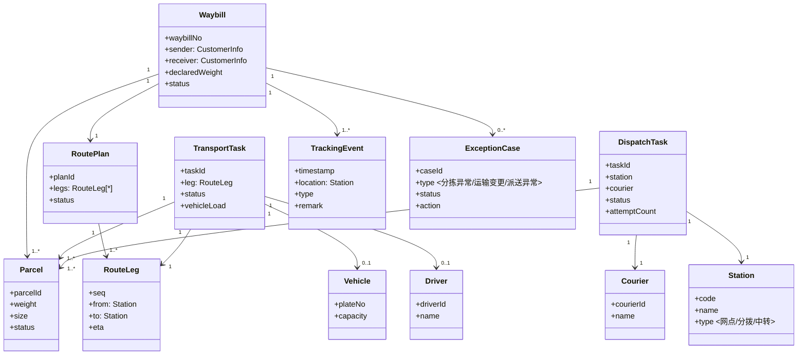
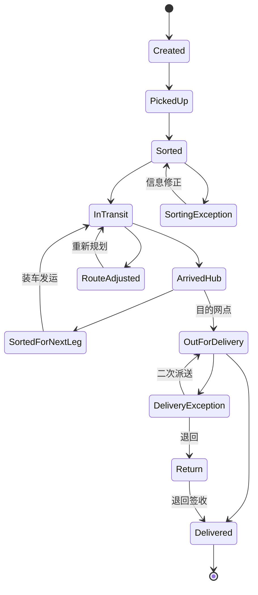

# 快递物流管理

第一阶段为小组任务，第二阶段为个人任务。

## Lab目标

1. 理解领域模型的概念
2. 理解领域模型的作用
3. 掌握构造领域模型的方法

一个好的设计应该能够在开始编码之前给出系统的大致结构，并进行初步的验证，这样在开始编码前就能避免一些方向性的错误，减少编码的复杂度，提高开发效率。

设计的难度在于对需求的理解和对设计结果的初步验证。

## 关于大模型的使用：

尽管不使用大模型确实会更有助于掌握领域模型的构造方法，但Lab不限制使用大模型。与大模型协作的方式为：

1. 完全不使用大模型，自行设计并验证。
2. 先不使用大模型，手工构造一个版本，然后使用大模型进行对比验证。
3. 先使用大模型构造一个版本，然后根据自己的经验对大模型的结果进行验证和修改。

可以记录下使用大模型的过程。

**下面内容不做要求，仅供思考** 

1. 大模型回答的质量在很大程度上取决于提示词的质量。在这里提示词就是下面的需求。可以思考一下是否可以通过改进下面需求的质量改善生成结果的质量。
2. 软件工程将软件开发分解为不同的阶段，是否在使用大模型的过程中，分阶段也能够改善结果的质量。

## 系统目标

快递物流公司利用运输网络和人力资源为客户提供**快速可靠的包裹传递服务**，并进行**成本控制**和**服务质量监控**，其主要业务是确保包裹从寄件人安全、及时地送达收件人。

系统的主要目标是
1. 实现包裹全生命周期的跟踪管理

快递物流公司的工作涉及多个环节，包括**揽收分拣**、**运输配送**和**末端派送**，第一阶段重点完成包裹物流的一部分场景。

## 用例：包裹处理与运输调度

### 正常流程  
1. 包裹处理通常由客户发起，客户通过网点寄送包裹。
2. 客户在网点填写运单信息，包括收件人地址、联系方式、包裹重量尺寸等，网点工作人员录入运单信息并打印运单号。
3. 系统根据目的地进行路径规划。
4. 系统根据路径规划结果和当前的站点，确定包裹的下一步流向（直接运往目的网点或其它中转站），进行分拣，并为该包裹生成运输任务。
5. 运输调度员根据当日包裹量、车辆容量、路线规划等因素，安排合适的运输车辆和司机。
6. 司机按照既定路线运输包裹，送到下一中转站或最终目的网点。
7.1. 如果包裹到达中转站，需要根据中转站的分拣规则进行分拣，继续第4步的流程
7.2. 如果已到达目的网点，系统将包括分配给派送员，派送员根据运单信息进行最后一公里派送
8. 收件人签收确认后完成整个流程。

### 扩展流程

1. 包裹分拣异常
   分拣过程中发现包裹地址不清晰、标签损坏或目的地不明确的情况，需要重新核对包裹信息或联系发件人确认地址。包裹需要标记为异常状态，等待处理。

2. 运输路线变更
   由于天气变化、交通管制、路况异常等因素，已规划的运输路线可能需要临时调整。调度员需要重新规划路线，更新运输任务，并通知相关司机和网点。

3. 派送异常处理
   派送过程中可能遇到收件人不在家、地址错误、包裹破损等问题。派送员需要通过系统记录异常情况，可能需要进行二次派送、联系客户或退回包裹。

### 系统需提供的基本的能力

系统应具备以下核心功能模块：

1. **包裹状态管理与追溯**  
   提供包裹全生命周期的状态查询、历史轨迹追踪和当前位置获取功能。  
   *示例：客户输入运单号，系统显示包裹当前状态"运输中"，历史轨迹"揽收→分拣→中转"，当前位置"上海分拣中心"，下一站"杨浦中转站"，预计到达时间"2025-12-01 10:00"*

2. **运输调度与任务管理**  
   司机可获取当日运输任务列表、路线规划详情、车辆装载清单。  
   *示例：司机查看"沪-京运输任务"，路线"上海→北京"，装载包裹数量"85件"*

3. **派送任务执行支持**  
   派送员可查看个人派送任务队列、收件人详细信息、地理地址和派送路线建议。  
   *示例：派送员收到"朝阳区派送任务"，包含10个包裹的列表 其中每个包裹显示包裹状态、收件人姓名、地址、联系电话等信息。*

**注意**

模型需要以某种方式进行验证，验证模型的过程是模型是否能够支持上述的主流程、扩展流程以及需提供的基本的能力。

## 第一阶段要求
以小组为单位，构造能够满足上述需求的领域模型。

Lab2第二阶段会有一个需求的增量，要求每位同学提交一个版本。

## 时间安排

1. 1周后提交，只需要提交领域模型。
2. 随后发布需求的迭代作为个人Lab

## 小组提交：领域模型

### 范围与假设
- 范围覆盖揽收、分拣、干线/支线运输、末端派送与异常处理，不包含收费结算和客服业务。
- 默认包裹一票多件可被同一运单管理，运输任务与派送任务可以绑定多件包裹。
- 路径规划由外部服务提供，系统以规划结果生成运输/派送任务并做异常改派。

### 领域核心模型（类关系示意）

### 包裹生命周期状态机（支持主/扩展流程）

### 核心聚合与职责
- `Waybill` 聚合根：管理包裹清单、生命周期状态、路线计划、异常记录与全量追踪事件。
- `TransportTask` 聚合：承载单个运输区段的调度，关联司机/车辆/负载清单，支持线路变更与任务状态流转。
- `DispatchTask` 聚合：末端派送任务队列，支持任务分配、二次派送、签收回单及异常记录。
- `ExceptionCase`：跨阶段异常的处理记录，驱动状态修正、改派或退回；与运单关联以保持可追溯。
- `Station`/`Vehicle`/`Driver`/`Courier` 作为资源实体，为任务分配与追踪提供上下文。

### 用例支持性验证
- 主流程：运单创建→路由规划→分拣生成 `TransportTask` →司机装车执行→抵达中转或目的网点→生成 `DispatchTask` →签收，皆有对应实体与状态流转；`TrackingEvent` 记录每一步用于追踪。
- 扩展流程：
  - 分拣异常：`ExceptionCase(type=分拣异常)` 挂到 `Waybill`，阻塞状态；信息修正后回到 Sorted。
  - 运输路线变更：`TransportTask` 支持 `RouteAdjusted` 状态并更新 `RoutePlan/RouteLeg`，通知司机与网点。
  - 派送异常：`DispatchTask` 捕获异常，创建异常单，支持二次派送或退回，并在 `TrackingEvent` 留痕。
- 基本能力：
  - 状态管理与追溯：`Waybill` 聚合持有 `TrackingEvent` 时间序列与当前位置（最近事件），可查询历史与下一站。
  - 运输调度与任务管理：`TransportTask` 提供任务列表、路线、装载清单、车辆/司机绑定。
  - 派送执行：`DispatchTask` 提供派送队列、收件人信息、地址与建议路线（来源于 `RoutePlan` 的末段或外部地图服务）。